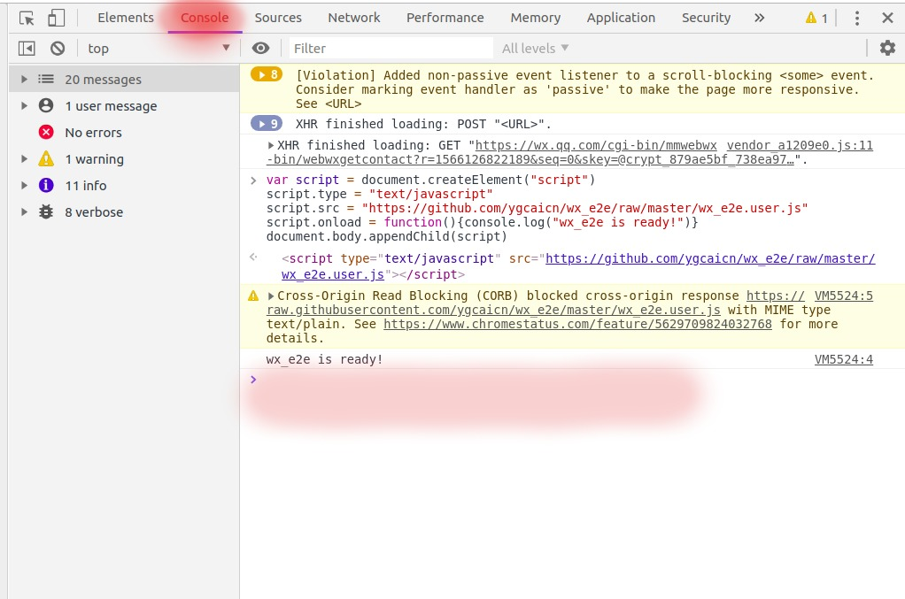

# wx_e2e
一个轻量级的，基于web微信的端到端加密通信，给你足够的隐私！

## 效果图

开启wx_e2e并连接成功后发送的消息均为加密消息：

*发送过程图中显示的明文消息*

手机端同步到的消息记录：

## 使用方法

### 方式1：
浏览器安装油猴插件
官网： <https://www.tampermonkey.net/>

安装好以后点击下面的连接即可安装此脚本：
https://github.com/ygcaicn/wx_e2e/raw/master/wx_e2e.user.js

### 方式2：

打开wx_e2e.user.js复制全部代码，浏览器中按F12，在console中粘贴代码。

