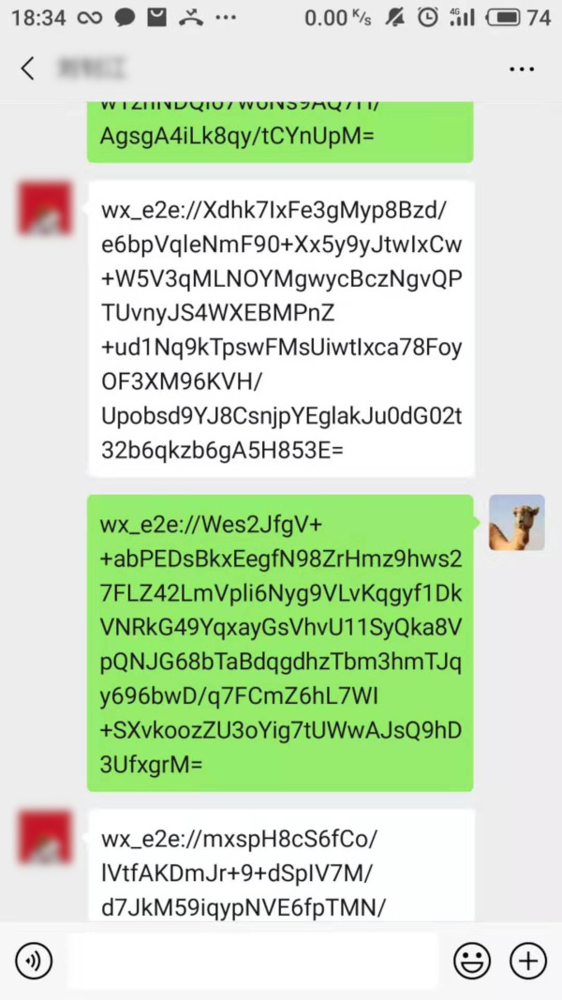
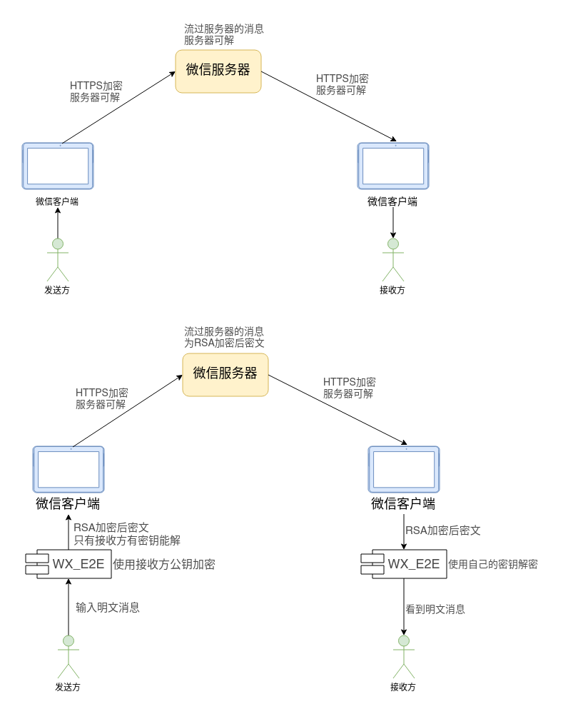

# 1. wx_e2e(微信端到端加密)

一个轻量级的，基于 web 微信([wechat](https://wx.qq.com))的端到端(e2e)加密通信，给你足够的隐私！

## 1.1. 效果图

开启 wx_e2e 并连接成功后发送的消息均为加密消息：

_发送过程图中显示的明文消息。_

手机端同步到的消息记录：

## 1.2. 原理

e2e含义：端到端加密 (End-to-end encryption，E2EE)是一个只有参与通讯的用户可以读取信息的通信系统。总的来说，它可以防止潜在的窃听者——包括 电信供应商、互联网服务供应商甚至是该通讯系统的提供者——获取能够用以解密通讯的密钥。[wikipedia](https://zh.wikipedia.org/wiki/%E7%AB%AF%E5%88%B0%E7%AB%AF%E5%8A%A0%E5%AF%86)

## 1.3. 使用方法

下面两个方法任选一个：

### 1.3.1. 浏览器插件（推荐）

浏览器安装油猴插件
官网： <https://www.tampermonkey.net/> *安装需要梯子！！！*

国内下载安装地址: <http://chromecj.com/web-development/2019-05/2157/download.html> *非必须情况下不推荐。*

安装好以后点击下面的连接即可安装此脚本：
<https://github.com/ygcaicn/wx_e2e/raw/master/wx_e2e.user.js>

### 1.3.2. 浏览器直接运行

在浏览器中登陆网页版微信后，打开 wx_e2e.user.js 复制全部代码，按 F12，在 console 中粘贴代码，并按`Enter`键。

## 1.4. License

- [LICENSE](LICENSE) ([MIT License][MIT])

[MIT]: http://www.opensource.org/licenses/MIT "The MIT License (MIT)"
